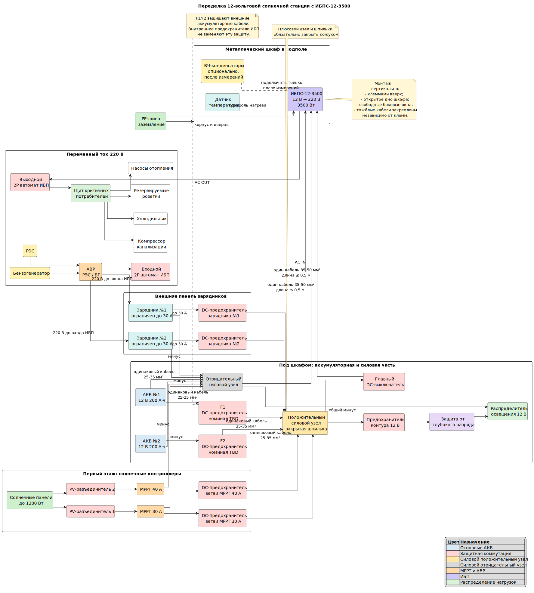

# AES — домашняя автономная энергосистема

Проект реконструкции домашней **12-вольтовой солнечной электростанции** с резервированием от районной электросети и бензогенератора.

Основная задача текущего этапа — заменить вышедший из строя инвертор и безопасно установить **СибКонтакт ИБПС-12-3500** в существующий металлический шкаф в подполе дома.

> [!WARNING]
> В системе присутствуют токи в сотни ампер, аккумуляторы с очень большим током короткого замыкания и напряжение 220 В. Документация в репозитории описывает конкретную установку и рабочий проект, но не заменяет проверку квалифицированным электриком, требования ПУЭ, инструкции производителей и расчёт защитной аппаратуры.

## Состояние проекта

**Стадия:** проектирование и подготовка монтажа.

Приняты основные решения:

- система сохраняется на напряжении **12 В**;
- основной ИБП — **СибКонтакт ИБПС-12-3500**, 3500 Вт;
- накопитель — **2 × 12 В 200 А·ч**, соединённые параллельно;
- MPPT-контроллеры на 30 и 40 А переносятся из подпола на первый этаж;
- малые аккумуляторы отключаются от основной батареи;
- суперконденсатор 1 Ф удаляется;
- ВЧ-конденсаторная сборка остаётся экспериментальным узлом и подключается только после измерений;
- два внешних зарядника ограничиваются током **30 А каждый**;
- освещение 12 В сохраняет прямое питание от аккумуляторов через отдельную защиту;
- распределительные силовые узлы и аккумуляторные предохранители размещаются под шкафом;
- от силовых узлов до ИБП используется одна короткая пара кабелей **35–50 мм²**, длиной не более 0,5 м.

## Общая архитектура

```text
Солнечные панели
    ↓
MPPT 30 А + MPPT 40 А
    ↓

АКБ №1 12 В 200 А·ч ── F1 ──┐
                              ├── общие DC-узлы ── DC-выключатель ── ИБПС-12-3500
АКБ №2 12 В 200 А·ч ── F2 ──┘                         │
                                                     ├── 220 В критичным нагрузкам
                                                     └── отдельный контур освещения 12 В

РЭС ──┐
      ├── АВР ── вход ИБП
БГ  ──┘     └── внешние зарядники 2 × 30 А
```

## Схема



Исходник диаграммы: [`03_схема_подключения_ИБПС-12-3500.plantuml`](./03_схема_подключения_ИБПС-12-3500.plantuml).

Диаграмма проверена и скомпилирована PlantUML 1.2026.1.

## Документация

| Файл | Назначение |
|---|---|
| [`01_схема_подключения_ИБПС-12-3500.md`](./01_схема_подключения_ИБПС-12-3500.md) | Подробная электрическая и физическая архитектура системы |
| [`02_план_переделки_солнечной_станции.md`](./02_план_переделки_солнечной_станции.md) | Пошаговый план демонтажа, монтажа, первого запуска и испытаний |
| [`03_схема_подключения_ИБПС-12-3500.plantuml`](./03_схема_подключения_ИБПС-12-3500.plantuml) | Редактируемый исходник схемы |
| [`03_схема_подключения_ИБПС-12-3500.svg`](./03_схема_подключения_ИБПС-12-3500.svg) | Скомпилированная схема |
| [`04_контекст_солнечной_станции.md`](./04_контекст_солнечной_станции.md) | История решений и полный контекст проекта |
| [`docs/`](./docs/) | Руководства и исходная техническая документация |
| [`photo/`](./photo/) | Фотографии существующей установки и оборудования |

## Основное оборудование

- ИБП **СибКонтакт ИБПС-12-3500**;
- два основных АКБ 12 В 200 А·ч;
- MPPT-контроллеры 30 А и 40 А;
- солнечные панели суммарной проектной мощностью около 1200 Вт;
- два внешних зарядных устройства, ограниченных до 30 А;
- бензогенератор;
- АВР между РЭС и бензогенератором;
- отдельная сеть светодиодного освещения 12 В;
- DC-UPS для сетевого оборудования;
- собственный UPS рабочего компьютера.

## Почему нужны внешние аккумуляторные предохранители

Предохранители внутри ИБП защищают внутренние цепи устройства, но не защищают кабель между аккумулятором и внешней клеммой ИБП.

При замыкании плюсового кабеля на металлический шкаф ток может пройти напрямую от аккумулятора, полностью минуя внутренние предохранители ИБП. Поэтому проектом предусмотрены отдельные **F1 и F2** максимально близко к плюсовым клеммам каждого основного АКБ.

Точный тип и номинал этих предохранителей пока не зафиксирован: он должен быть выбран по сечению проводов, времятоковой характеристике, отключающей способности и рекомендации производителя ИБП.

## Особенности размещения ИБП

Существующий шкаф используется как:

- защита оборудования от возможной протечки сверху;
- механический кожух;
- частичный акустический экран.

Планируемая переделка:

- удалить основную часть дна шкафа;
- обработать и закрыть металлические кромки;
- обеспечить свободный приток воздуха снизу;
- сделать вентиляционные окна напротив боковых вентиляторов ИБП;
- установить сетку от грызунов;
- установить датчик температуры;
- разместить силовые узлы и защиты под шкафом, непосредственно над аккумуляторами.

Шум нельзя снижать перекрытием вентиляции: при номинальной мощности ИБП рассеивает значительное количество тепла.

## Порядок ввода в эксплуатацию

Первый запуск выполняется поэтапно:

1. АКБ и ИБП без нагрузки.
2. Проверка холостого хода и нагрева соединений.
3. Подача сети и проверка встроенного заряда на 15 А.
4. Подключение малой нагрузки.
5. Подключение первого внешнего зарядника.
6. Подключение второго внешнего зарядника.
7. Подключение MPPT 30 А.
8. Подключение MPPT 40 А.
9. Ступенчатые испытания на 200, 500, 1000, 2000 Вт и выше.
10. Испытание с закрытым шкафом.
11. Проверка работы от бензогенератора.
12. Отдельный эксперимент с ВЧ-конденсаторной сборкой.

Полный порядок приведён в [`02_план_переделки_солнечной_станции.md`](./02_план_переделки_солнечной_станции.md).

## Контролируемые параметры

При испытаниях измеряются:

- напряжение непосредственно на выводах АКБ;
- напряжение на клеммах ИБП;
- падение напряжения в плюсовом и минусовом кабелях;
- ток каждого аккумулятора;
- температура наконечников, предохранителей и силовых узлов;
- температура воздуха внутри шкафа;
- работа вентиляторов;
- переходы «сеть → резерв → сеть»;
- работа от бензогенератора.

## Открытые вопросы

- точная химия, модель и состояние основных АКБ;
- допустимый суммарный зарядный ток аккумуляторного банка;
- окончательный тип и номинал F1/F2;
- выбор между кабелем 35 и 50 мм² на участке до ИБП;
- допустимость наконечника 50 мм² на клемме М6;
- реальный диапазон допустимой частоты бензогенератора;
- коммутация нейтрали внутри ИБП и работа УЗО в автономном режиме;
- измеримая польза ВЧ-конденсаторной сборки.

## Принцип ведения проекта

Репозиторий фиксирует не только итоговую схему, но и причины принятых решений, последовательность работ, результаты измерений и изменения реальной установки. По мере монтажа документация должна обновляться вместе с фотографиями и фактическими номиналами компонентов.
